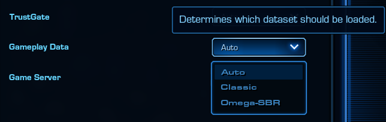
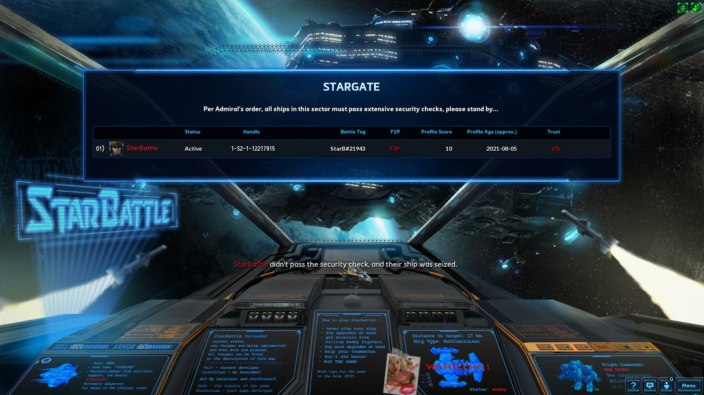

# [v2.0] - 2021-08-15

This update focuses on improving adoption of the game on NA region. It doesn't feature any balance changes.

> **Notice:** Due to possibility of bugs this version hasn't been published on EU region yet - it's currently only available on NA. It'll be deployed on EU in a follow up release, likely the next one - 2.1.

## General:

- Extended lobby to 15 players slots - as an extra tool for hosts to mitigate smurf/trolling issue. 
- Introduced option allowing to load different Gameplay Data from the same map - [learn more](#1-gameplay-data-variants).
- Introduced Omega-like variant of the game, called `Omega-SBR` - [learn more](#2-variant-omega).
- Introduced TrustGate system to keep smurfs in check - [learn more](#3-trustgate).
- Slightly improved various FX effects, such as:
  - Torpedo marker - greatly reduced its intesivity.
  - Needle spines on Gauardian - will now use projectiles colored in green, to make them easier to notice.
  - Protoss towers and its projectiles.
  - (.. and some other minor things that aren't worth mentioning).
- Ported tournaments rewards from latest Omega version, which should reflect all past community tournaments.

## UI:

- This patch sets a first step towards revamping various UI panels - such as ship selection, console panel, score boards etc. In this iteration we've avoided changing positions of UI elements, and only improved clarity by changing fonts and color palette.
- Removed useless elements such as army hotkey and hero panel.

## Bugfixes:

- Fixed upgrade counter - where it'd start from 100 and count down for every acquired level. It'll now count up beginning from 0.
- Updated a lot of descriptions of ship's upgrades to ensure they reflect the reality - if values have changed on tooltips, it means these were out of date (again, no balance changes in this patch). \
Furthermore improved formatting of tooltips, so they're easier to grasp.\
Notice: This is an ongoing task - not all descriptions have been verified yet.

---

## Details

### 1. Gameplay Data Variants

This feature was inspired by the ongoing issue - where since deparartue of zedu, each region had its own SB version.

We've based SBR on a version that was closest to the original, with better balance around competitive scene. Which is SB by EtaC - known as `SB3.1` on EU, and `SB3.5` on NA.

However, that version never took off on NA. Which had it's own equivalents - first SBX, then Omega which was based on SBX. Unfortunately these equivalents have devolved significantly from the original.

Due to that reason we've decided to introduce a feature called Gameplay Data Variant, that allows us to load different gameplay modes, within the same map. Currently this feature is limited to:

- Classic - based on SB3.1/SB3.5 (nothing new).
- Omega-SBR - inspired by some of the changes introduced in SBX/Omega.

In the future we'll likely use this option in other ways, either to conduct some experimental balance testing (like beta testing of new ships) or anything else, that might be made purely for fun - TBD.

### 2. Variant: Omega

#### Balance / Gameplay

We've identified the key differences between SB3.1 and Omega that affect the pace of the gameplay, and have incorporated them to our `Omega-SBR` variant. These include:

- Mineral gain from killing AI fighters (creep)
- Starting speed of the ships
- Additional starting energy points, that encourge spell openings.
- Starting hull armor on towers, life & armor regeneration speed, detection.
- Double heal ray on the bases with extended range.
- Minimap icons of the ships. With extra improvement - we've made them compatible with Arbiter's Phantoms.

In terms of abilities, differences still remain - but we believe these differences will factor positively.

However as the match progresses - the game will evolve more towards gameplay known from 3.1/3.5. Due to the fact that we've only changed the starting values. Most importantly, with every upgrade of the base, towers will gain on strength (armor + shields), and money gained from killing AI fighters will keep raising. See below for exact values.

#### Gameplay differences

##### Major differences between 3.1 and Omega, in relation to original 

Omega:

- Capital ships are faster by +0.1 **(incorporated into Omega-SBR)**
- Capital ships start with +25 energy or +75 in case of tanks **(incorporated into Omega-SBR)**
- Light fighters are faster by 5% (not only you arrive faster to the creep, but creep arrives faster to you) **(incorporated into Omega-SBR)**
- Light fighters (Phoenix/Viking) = 6 minerals **(incorporated into Omega-SBR)**
- Siege fighters (Tempest/SkyFury) = 15 minerals **(incorporated into Omega-SBR)**
- Base has two heal rays with range increased from 5 to 8 **(incorporated into Omega-SBR)**
- Upgrade of the base does not affect the mineral gain from killing creep.

SB3.1/SB3.5:

- Capital ships start with the same speed as in the original
- Capital ships start with the same energy pool as in the original, except tanks which start at 200.
- Light fighters have them same speed as in the original
- Light fighters (Phoenix/Viking) = 5 minerals (same as in the original)
- Siege fighters (Tempest/SkyFury) = 10 minerals (same as in the original)
- Base has one heal ray with range increased from 5 to 5.5, and it restores 175 life/shield per in-game second (10% more than in the original).
- Each upgrade of the base grants: +1 mineral for light fighters, +3 for heavy fighters, +4 for siege fighters - the further you're in the game, the more money you get (exclusive to 3.1, not present in the original). **(incorporated into Omega-SBR)**
- Towers: initial hull & shield armor is slightly higher, additionally towers regain life and shields faster when out of combat.
- Towers: each upgrade of the base increases the armor further. Additionally towers also gain extra shield points. **(incorporated into Omega-SBR)**

##### Differences between 3.1 and Omega-SBR in terms of ship's abilities

Rough overview:

- General: Abilities damages do not scale with energy upgrades.
- Battlecruiser: Nuke applies lockdown instead of blackout
- Frigate: Ripwave warheads doesn't bypass FF/PDDs
- Dreadnought: Gatlings scale better
- Raven: Blackout range reduced, enhanced systems increase EMP radius, not energy drain
- Carrier: Scouts are viable
- Voidray: Nova buid (bruiser/leech) viable, purify removes defensive effects
- Colossus: Hardened shields and shield recharge improved
- Leviathan: adaptative plating→animosity, up to 40% armor and attack speed
- Guardian: Darkswarm no longer heals (for now), battleguardian has a new passive
- Overlord: contaminate improved

#### Visuals

Omega/SBX has not only changed gameplay - it also changed a variety of visual effects, leading into direction that doesn't align with our vision for this project.

SB was once known as a battle between warfleets of Terran (red) and Protoss (blue). Yet SBX/Omega have almost completely ditched this part of the game. Instead there's the "red team" - as it is now called, with the base building being a Taldarim Mothership.. that happens to send out Terran fighters into the battle? Furthermore towers protecting base have been turned into some advanced protoss units, throwing fireballs at the enemies? That's neither Terran nor Protoss weaponry.

The "blue team" has similar story, instead of Protoss Mothership there's some weird construct ([in SC2 lore known as home warship of the Purifiers](https://starcraft.fandom.com/wiki/Cybros)), with glitched animations. Same could be said about towers that accompany it - some ancient structures, which look like they don't belong to the space..

In a game like this lore isn't particularly important, but as it stands that version of SB not only ditched lore, but also degradated aesthetics and by that clarity of what's actually going in game. Every visual change has been exeggerated, to the point where Frigate and BC instead of missiles use red lasers/energy balls as its ammo. This makes no sense regardless of the criterium - both lore & visual clarity have been impacted negatively.

We've called game Reloaded because it's something we're devoted to follow - loading back to original, and building on top of well established foundations.

Regardless, we'd like to acknowledge authors of SBX and Omega for their efforts. And despite of our vision of the game not aligning, we did find some inspirations and features that may have find its way into SBR.

First addition are minimap icons of the ships. Thanks to Graveyard and Suge for making it!

### 3. TrustGate

TrustGate is autonomous anti-smurf system. That will attempt to keep obvious and semi-obvious players hiding behind newly created game profiles out of the game. Unfortunately, due to technical limitations this cannot be used to protect lobbies - that's why there are 15 slots to accompany it, even though the game won't allow more than 12 players to participate.

It can be activated by the player hosting the lobby. There are 3 choices:

- `Auto` (default)
- `Enabled`
- `Disabled`

As default (`Auto`) it'll be enabled for games hosted on NA region (unless lobby is started with less than 10 players), and disabled on EU.

#### How does it work

System will be launched right after loading screen, and will verify all connected players - determine their trust factor, by taking into consideration:

- Any purchases made on the account / access to campaigns (currently limited only to campaigns, in future it'll also check for *any* purchase made on the account - coop commander, voice pack, anything).
- Game profile age - when account was registered).
- SC2 profile score - achievements / terran level / coop level etc. - anything that takes actual play-time to acquire.
- Participations in past SB tournaments.

Using above data system will determine trust factor of a player. If it'll be below certain threshold, such player will be stopped from entering the game - it won't get the ship, nor will be assigned to any of the teams.

However, we're aware that even with 15 slots in lobby, half of the connected players may be the same person or a group. Thus this still requires some work from the host. Basically the better job the host will do at ensuring the number of smurfs in lobby is low, the more players will get to play. 15 players lobby with 5 smurfs will end as 5v5.

#### It's not bulletproof - at least not yet

It's more than likely that system will require some tweaking, and testing for possible weak points. Also, it has also small potential of hurting legitimate players with new accounts. So depending on the course of actions, we're considering following improvement:

- In case where trust factor of a certain player will be slightly above the threshold, then system will announce that player is not eligible to join the match, unless a player with high trust factor chooses to vouch for them. Basically, it'd be opposite of votekick. And it'd take place before ships are spawned. Because when you have to votekick when game is already going, then whole game experience is ruined.
