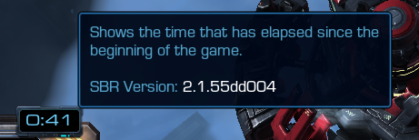

# [v2.1] - 2021-08-19

## General:

- Changed *Beginner's ship* build of BC to: speed +2, range +2, missiles dmg +1.
- Extended time to select a ship from 60s to 90s.
- When ship is not selected before timeout occurs, a random ship will be assigned instead of what was currently an active choice (BC as default - if not changed).

## UI

- Reverted the change of font - so that text no longer looks "weird". (It'll be revisited at a later date).
- Refurbished a little bit look of all existing panels, including ship selection.

## TrustGate:

- Time left until a player will be dropped due to a timeout will now be shown - if they're AFK, and you want to wait for them, simply pause the game.
- Added tooltips to some of the fields in the table, to clarify their meaning.
- Trust score will now include more sources of data about game profile - something that smurfs could acquire, but are unlikely to, it takes time to develop, but players develop it naturally (yes, that's a riddle ;)). \
  It should allow legit players on F2P accounts playing nothing but arcade to score a little big higher, so they can pass the gate.
- Threshold required to pass changed from 10% to 3%, which is now a baseline. Additionally that value will be adjusted dynamically:
  - +1% for every computer player removed from the `Optional slots` in the lobby.
  - +2% for extra human player in the lobby than it is required for the game (12 players).
  - As an example, 15 human players would be +3% (3 computers removed), +6% (3 extra players), on top of the baseline value it would make it 12%.
  - This should serve as an intuitive way of balancing the "gate" depending on the "situation".
- In case where odd number of players passes the gate, then the one with lowest trust score will be forced to observe.
- In case where more than 12 passes the gate, then those with lowest trust score will be choosen to observe.
- Fixed a bug where date related to creation of game profile could be incorrectly inferred, and grant undeserved trust points.
- Fixed a bug where players who had SC2 window minimized during the process wouldn't pass the check, even if they played on account with SC2 campaigns purchased. \
**However, players on F2P (free to play) accounts are still required to have SC2 active (not necessarily focused - it can be running in "background"), in order to pass the verification.**
- Fixed a bug where portraits wouldn't always be displayed for some of the players.

> Thanks to Nox for helping us make this system better by providing suggestions and debugging data (sc2replay).\
> (Although further tunning may still be required)

## Bugfixes:

- Fixed an issue that prevented match from being rated when there were computer players present in the game.
- Fixed tutorial being loaded instead of `Omega-SBR` gameplay data, when it was choosen explicitly in the lobby.
- Fixed visual indicator of BC's Scanner Sweep not being aligned with its actual effect range (`8.25`).
- Fixed Vortex to shutdown personal cloaking field of VR, so that energy is not being drained.

## Versioning:

Current version of the map will now be shown in the tooltip of a Mission Timer. The format will go as follows: `MAJOR.MINOR.BUILD`, i.e. `2.1.55dd004`, the first two digits will always correspond to a specific release that will never be published without patch notes.

This is done to make it easier to identify if the version of the game you play on NA/EU is the same one, because the version numbers shown in Arcade section, will pretty much always be out of sync, and shouldn't be taken care about.

> To explain further:
> - In general we'll do `MAJOR` releases whenever something new.. and *major* is introduced - be it gameplay content, some kind of mechanic or anything that affects the game significantly.
> - While `MINOR` releases will be reserved for bugfixes and reiterations on the content introduced in `MAJOR` release.
> - And lastly, `BUILD` will change for every update (it corresponds to Git commit hash), but not every update will be signficant/relevant enough to state what was it about in the patch notes.
