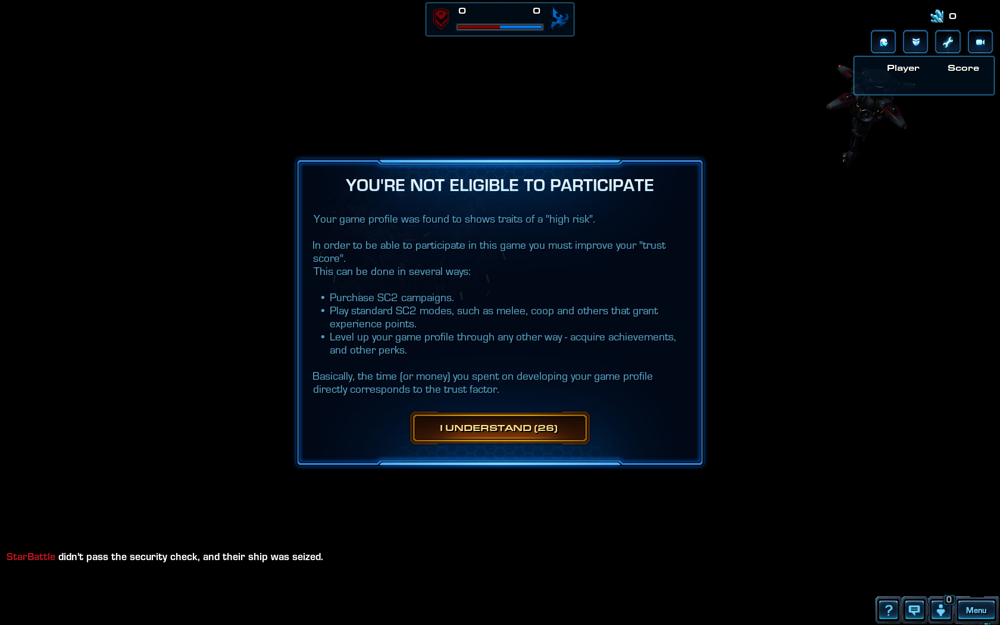

# [v2.2] - 2021-08-22

> This patch *should* be stable, and goes to both NA and EU - so they're back in sync.
> However the strategy of updating just one region (preferably NA - less popular, and with higher tolerance for changes), before the other might be used again in the future, where there is an update that has potential of breaking stuff. So *ideally* EU region will only receive tested updates.

## TrustGate:

- A lot of improvements on the UI side of things:
  - There are multiple steps of verification a player needs to complete - the progression will now be shown for each player individually. To make it clear whether someone is just completely alt-tabbed, or is just slow to complete the verification.\
  Additionally in the tooltip of a Trust column, each completed step will be listed with an information about how long it took. Often times this value directly corresponds to player's network latency to the game server (mostly on the first few steps, not so much on the later ones).
  - Date of when game profile was created will be displayed in format "X years/months ago" (exact date will still be available in the tooltip).
  - Once the verification concludes, there'll be short countdown indicating when exactly game will begin.
- Slightly increased timeout value, so that players who experience lag spike or some temporary connection issues can pass the check.
- Changed method of detecting when player is AFK - it now also catches mouse events when SC2 window is not in focus, additionally it listens for key presses.
- Fixed an issue where players with lowest trust score weren't prioritized for observers.
- Players assigned to observe the game will now gain access to classic Observer Panel, access to team chats of both teams and additionally have the ability to see the command card of any selected unit, browse profiles of ther players - achievements and such. The observer-player can still use `All chat` to communicate, thus there's a potential where it could be abused. If that happens, we'll take necessary steps.
- Players who fail to pass the gate will be informed why, and what they can do about it.

> At this point, TrustGate is considered to be feature complete. And hopefully bug free.

## Bugfixes:

- Fixed `Elite Colors` of Arbiter and Carrier model not being reflected appropriately by a Phantom.
- Fixed `Waiting for players` dialog window - where it wouldn't appear in an event of connection issues. (Bug introduced in v2.0).
- Fixed Arbiter's phantoms being uncotrollable when casted on a ship aribter had no control of to begin with. (Bug introduced in v2.0).
- Fixed Tutorial mode, where enemy BC wouldn't spawn. (Bug introduced in v2.0).\
  Additionally tutorial will guide a player to get +2 speed, +2range as an opening build, instead of lasers.
