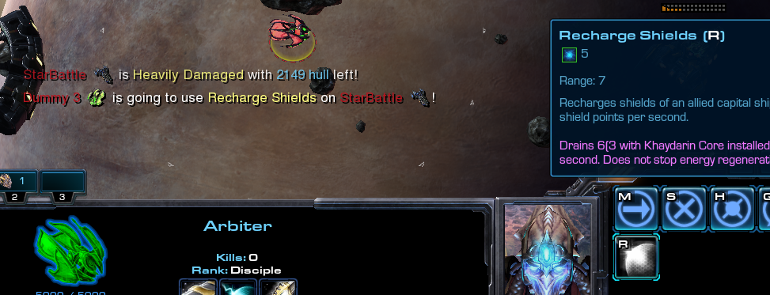

# [v2.3] - 2021-08-28

## General:

- Introduced minimap icons of capital ships known from Omega (credits to Graveyard and Suge!). However, these icons will only be visible to team, unlike in the Omega. Enemy ships will remain to be shown as unidentifiable squares.
- Enlarged message area for notifications - primarily for kill announcments. Also improved the way announcments are presented - in addition to player's names, the icon of their capital ships will also be shown.\
  
- `Install` menu on capital ships will now be *sticky* - meaning it won't close automatically after ability is acquired. And will be consistent with the way `Upgrade` menu operates.
  > This change *may* require some time to get used to, and wasn't exactly planned. However that inconsitency has shown to be a problem during implementation of ability callouts, and had to be either worked-around, or changed.
- **[Experimental]** Increased `Air Formation Diameter` from 8 to 13 - units are now more likely to maintain formatio.
  > How likely, mostly depends on whether all selected units are within defined defined diameter. As well as on distance from the *central* position of selected units, in regards to the new order. Basically moving over *long* distance maintains formation, moving *short* distance not so much, but that's desired to provide a way of clumping units, if desired.
  >
  > This change was initially aimated aimed at Broodlord + Corruptors combo - to make them easier to micro.
  > **However, it effects all units** - regardless of who controlls them, and how (that includes OBF). It also affects AI fighters - and everything that moves as a group - specifically, when the same order is issued to a group of units, thus Carrier's Tempests are unaffected.
  >
  > As noted, this is experimental change due to the fact it also affects AI fighters. Further testing is required to determine whether it'll factor positively, or negatively. In case of the latter, we'll use another method, that will work on per-player basis.

## Callouts:

Introduced callouts feature, which allows to *ping* certain UI elements, as a way of reporting various events to the team - hence "callouts". It's inspired by Heroes of the Storm.

Currently supported UI elements:

- Buttons of Abilities, on the Command Panel
  - To inform about acquired abilitities, and whether they're available to use at a given time.
  - To inform about cooldowns, and their progress.
  - To inform about current target of an ability, or the intentions to use it (when ability is casted while being out of range).
- Mineral label/icon, on the Resources Panel
  - To report amount of unspent/available money.
- Unit's wireframe / vital labels, on the Info Panel:
  - To call for help when heavily/critically damaged/injured.
  - To report status of vitals (life, shields, energy), before or during the engagement.

etc.

### How it works

To trigger a ping, use `MiddleMouseButton` on any of the above elements, and everything relevant that's represented by the UI element, will be reported in team's chat.

**Notice**: `MiddleMouseButton` can be changed in the Hotkeys menu in SC2 options to suit player's preferences.

> Why not `Alt+LeftMouseButton`?
> 
> *Technical limitations*.. it's _likely possible_ to make it work with `Alt+LMB`, but it migt have some unwanted side effects. Furthermore that specific combinations of keys (involving `Alt` as a left click modifier) is simply difficult to "catch", and for now it was deemed as something not worth the time needed for experimenting. It'll likely be revisited in the future, though.

## Bugfixes:

- Variant `Balanced`:
  - Fixed computer players from `Team 2` aka `Optional slots` being taken as game participants (they'd get the capital ship), if there was less than 12 human players in the lobby, and `TrustGate` was disabled.
- Variant `Premade / IH`:
  - Fixed inability to add more than one observer - number of player slots has been reduced from 15 to 12, what leaves room for 4 observers once again.
  - Fixed `FFA` team setup, to include all players and force autobalance as it was previously.
- Fixed minimap icons not respecting `Elite Colors`.
- Fixed custom console skins to be properly supressed.
  > This required introducing custom race definition - only for the purpose of maintaining consistent UI interface, that's immune to built-in races, or player selected console skins.
  >
  > Thus these changes also carry a bit further - to SC2 Menus, or Observer interface. If something has been changed for worse, please report it.
