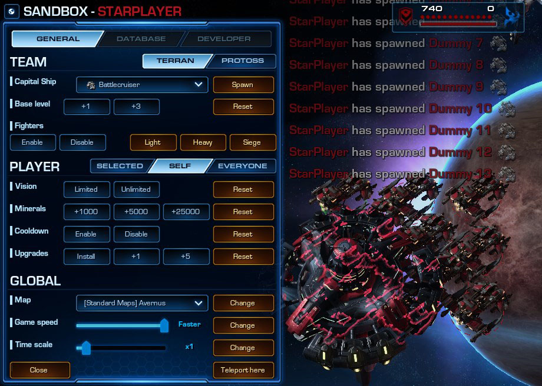

# [v3.0] - 2021-10-03

## General

- Introduced Sandbox mode - [learn more](#sandbox-mode).
- Capital ships and AI fighters will now be outlined when "hidden" behind a base building (Command Center / Mothership).
- Sound alerts will use custom announcer depending on the selected ship's race, it will be either Tychus, [Alarak](https://youtu.be/KfOJ60tbFFs?t=34) or [Abathur](https://www.youtube.com/watch?v=iWQ-KksWzRI&t=18s). Currently used for: ship upgrades etc. ; additionally base upgrades notifications, nuke/torpedo notifications, victory/loss.

### Battlecruiser

- Mini Yamato Gun **[new passive ability]**:
  - Upgrades weapons systems of a Battlecruiser with Mini Yamato Gun, a passive variant of the Yamato Cannon.
  - Deals up to 1200 damage to non-light targets in range of 9. It needs 12 seconds to cooldown.
  - Despite its high damage output, it cannot penetrate armor at an effective rate. Every armor point of the target, decreases damage dealt by 30. Rendering the weapon ineffective against heavily armored targets.
  - Weapon scales with Yamato Cannon Upgrade - each level decreases cooldown of the weapon by 1 second.
- Missile Pods:
  - Removed incorrect information about bonus damage given to Missile Pods from upgrading Longbolt Missiles
  - Removed 10% damage increase from upgrading Missile Silo, and replaced it with +6 damage increase vs light targets only.
  > The way this ability scaled its damage through upgrades was needlessly complex, and has also given incorrect information about total damage in the ability's tooltip, as it included "bonus" dmg from the Longbolt Missiles, which was non-existant.\
  > The +6 damage increase is equivalent to +5% increase of **base** damage (non upgraded). meaning that it was effectively increased by a flat number, regardless of upgrade's level. That number is now used in the tooltip for clarity.\
  > Simply saying, it's a 50% damage nerf.
- Yamato Cannon: reduced research cost from 175 to 150.
- Scanner Sweep: reduced range from 8.25 to 7.

### Frigate

- Torpedo: cancel energy cost reduced from 100% to 75% (150 energy).

### Arbiter

- Observer:
  - Will be automatically assigned to defined control group.
  - Visual scale increased by x2.5.

### Guardian

- Wild mutation **[new active ability - ultimate]**
  - Increases Guardian's movement speed by 0.2 and, zerg minions by 0.4, lasts 15 seconds.
  - Comes as replacement of Infestation
  > Infestation will be tweaked and moved to Queen ship (WIP)
- Parasite removed.
  > It has been moved to the new Queen ship (WIP), where it fits better.
- Broodlords and Corruptors have been split - they exist as distinctive abilities once again.
- Broodlings:
  - Base claws damage increased from 5.6 to 7.
  - Claws range increased from 0 to 0.2.
  - Bonus damage to claws increased from 2.5 to 3.0 per level of Broodlings upgrade.
- Corruptors:
  - Base HP increased from 50 to 100
  - Base armor reduced from 3 to 1
  - Move speed reduced from 1.65 to 1.55
  - Base damage increased from 15 (+5 vs. Massive) to 20 (+10 vs. Massive)
  - Weapon attack speed reduced - period changed from 0.5s to 2s
  - Weapon range reduced from 6 to 4
    - Corruptors Upgrade
      - Bonus to damage vs. Massive increased from 2 to 3 per level
      - Bonus to armor increased from 0.75 to 1 per level

### Leviathan

- Interception can no longer be used on `Light` units.

### Bugfixes

- Restored missing Infinite Barrage upgrade to Carrier's Plasma Channel

## Details

### Sandbox mode

It's a special game mode, that follows standard game rules, but allows players to bend these rules. Its main goal is to serve as practice & testing utility, however it's also completely compatible with multiplayer, thus it can be used for fun too!

The main difference in the way it operates between singleplayer and multiplayer, is that if you play it solo, you also gain control of the enemy ships that you spawn, where if there are other players in the game - on the opposite team, then the spawned ship belongs to them and acts like a leaver ship.

In multiplayer there might be only one player at a time having exclusive control over the sandbox - intially it is the player who hosts the game (if host leaves lobby then it's no longer guaranteed). Every time a cheat is used, this fact is announced in a global message.

Other players in the game cannot access tools in sandbox, until the player who's currently in control releases it voluntarily, or leaves the game. Sandbox panel appears on the left side of the screen, and can be minimized [<kbd>`</kbd>], at any point without releasing control.

Notice: Banks and player rewards aren't loaded in that mode. Autobalance based on rating isn't available.

See it in action:

