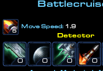
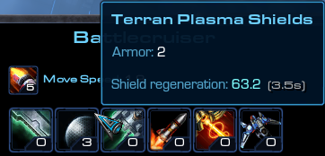
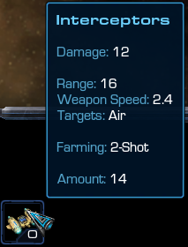
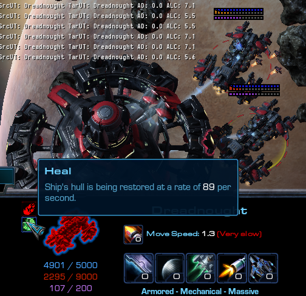
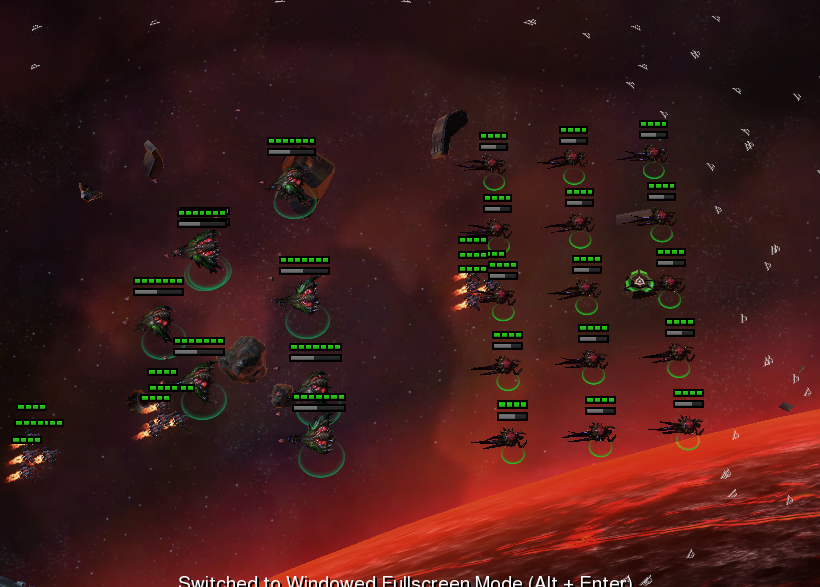
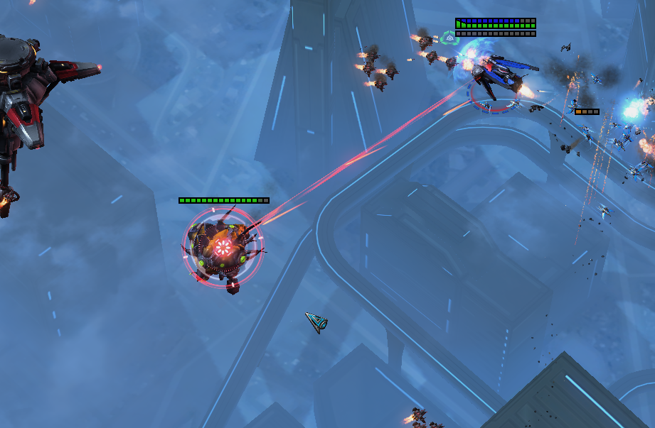

# [v4.0] - 2021-10-29

## General

- Introduced basic `Ship Restrictions`
  - Ships are now locked behind win requirements. (Requirements are subject of change).
  - Can be disabled via lobby attribute.
  - Restrictions don't apply on:
    - Unranked games.
    - Tournament participiants.
    - On ranked games, if specific team doesn't have at least 3 players with 200 games or more on its side.
- Tweaked `Ship Limit` so that VoidRay and Carrier share the same pool.
- Implemented new skins for tournaments:
  - Elite Dreadnought (credits to AlleyViper)
  - Elite Colossus (credits to Kerberus)
  - Elite Overlord

## UI

- Extended standard unit panel with extra informations:
  - Movement speed (and engine upgrade level in case of capital ships).\
    
    > While this info was already available in the tooltips, now it's exposed in equal to its importance.
  - Passive life, energy and shield regeneration (in tooltips).\
    
    > 1st value = amount of vital regenerated per in-game second\
    > 2nd value = delay in in-game seconds needed for passive regen to kick in (aka *out of combat time*).
  - On-Board Fighters amount (in tooltips).\
    

## Ships & Balance

- Observer, Spotter, Tempest (Carrier's), Corruptor (Guardian's), Brood Lord (Guardian's) are now considered to be `Summoned` units.
  > This is done for better classification - which current & future abilities/buffs may affect these units.
- Towers can now detect cloaked units in range of 9.3. (There's still a significant gap between them). Range of detection will be shown when selecting a tower, in addition to the weapon range.
- Tweaked heal ray of the base:
  - Amount of HP being restored will now vary, relatively to how signficiant hull damage the ship has taken.
    > The formula is rougly:\
    > `hull_restored = clamp(x * heal_ratio, min, max) * base_value`
    > 
    > - `x` = hull dmg factor of the ship (as in `current_hull` divided by `max_hull`)
    > - `base_value` = 160
    > - `heal_ratio` = 2.0
    > - `min` = 0.5
    > - `max` = 1.1
    > ---
    > For reference:
    > - `SB zedu`: range 5.0 - 150 per second - x1 beam.
    > - `SB v3.1`: range 5.5 - 175 per second - x1 beam.
    > - `SBO/SBX`: range 8.0 - 150 per second - x2 beam.
  - Amount of HP being restored can be seen in the tooltip.
    
  - Added second ray:
    - 1st ray will always prioritize most damaged ships - no change.
    - 2nd ray will ignore the damage aspect, and prioritize targets with lowest amount of **maximum** hull (not current). Additionally, it can re-target at any time. In situations where some other ship with lower total hull gets in its range, even though initial target hasn't been fully healed.
    - Both rays restore the HP using same formula.
  > This approach should add a little more dynamic to the game, while still having balance at a competitve level in mind - ships that overextend will be punished, without blocking entire team.

### Unit management

- Added second control group for spawned units. Second control group is already in use by Guardian. Spawned Corruptors go to the first group, spawned Brood Lords to the second group.
- Added formation movement - aimed at minion ships (currently Guardian specifically). It's enabled as default - it doesn't conflict with anything (such as OBF), and can potentially help when controlling multiple capital ships under the same selection. This feature [can be disabled in options](./v4.0/options-formation-movement.png).\
  

### Arbiter

- Added minimap icon for Observer.
- Boost:
  - Can no longer be used on any allied unit. It's now limited to: `Massive`, `Summoned`.
    > Ability to use boost on structures was introduced mainly with intention of boosting heal ray on the base - to speedup regeneration of the ships. However, that wasn't working at all. In regards to towers - the use case here was limited to DPS or regen. Yet, regen ratios on towers are so low, that it likely wasn't worth it any situation - boosting ships to increase their life, shield, energy, cooldown regen is just always better, as ships strength scales better than towers as game progresses.
    > 
    > Additionally after quick re-evaluation of the concept of support abilities synergizing not only with capital ships, but also with static defense, we've concluded that's not something worth exploring right now. Thus we take a step back, before it's gone too far. (It's already enough that Arbiter can cloak the towers).

### Battlecruiser

- Adjusted mover of the nuke:
  - During first ~4s its move speed will be slightly higher, 2.1 instead of 1.9 as previously (1st motion phase).
  - After that it'll slow down to 1.8 (2nd motion phase).
  - If it gets in close proximity of the target, it'll be able to accelerate to 2.0 (3rd motion phase).

### Frigate

- Ripwave Warheads: changed model to visually differentiate them from Backlash Rockets.
- Afterburner: visual effect will scale in relation to level of Frigate engines.

### Raven

- Analyze Weakness **[new active ability]**:
  - Allows Raven to lock on the enemy target to reveal its weakness - rendering it more vulnerable to ranged weapons and targeted abilities of its allies
  - Additionally target remains revealed, regardless of the line of sight.
  - Effect lasts as long as Raven remains locked onto the target.
  - Maintaining the lock drains energy from Raven.
  
  

### Guardian

- Corruptors:
  - Energy cost of spawning decreased from 50 to 40.
  - Time life increased from 45s to 60s.
  - Turn speed increased from 180°/s to 720°/s.
  - Acceleration tripled (full speed will be reached less than 2s instead of 7s+).
  - Increased separation radius of corruptors and their cocoons by 50%.
  - Improved automatic target acquisition:
    - Won't priotize enemy OBF in favor of anything else.
    - Will prioritize targets that are close, or closer to their previous target.
    - Will actively scan for targets past their weapon range.
    - Less likely to acquire the same target, and shot multiple times at a target that can die from one shot.
      > Although it'll keep happening in some degree - especially when all corruptors are clumped and ready to shot. However spreading them just a tiny bit will help in the long run, once weapon cooldowns will desync between corruptors. As in such case they will attempt to acquire a target, which isn't currently acquired by another corruptor, if that fails they'll favor distance from position to where their initial target was acquired for the first time (not where it has died).
  - Upgrade:
    - Armor reduced from 1 to 0.5 per level.
    - Life amount increased from 5 to 10 per level.
    - Life regeneration ratio increased from 0.3 to 0.8 per level.
- Added ability to rally cocoons of Brood Lords and Corruptors while they morph.
- Wild Mutation:
  - In addition to the increased movespeed, the effect will also multiply acceleration ratios, increasing it by:
    - +20% on Guardian
    - +100% on Guardian's minions
  - It'll now also apply to allied minions - spawned by another Guardian.
- Corrosive Acid:
  - Can no longer be used on any enemy unit. It's now limited to: `Massive`, `Structure`, `Summoned`
- Decay:
  - Percentage damage reduction from each stack is now additive rather than multiplicative (minor buff).
  - Added visual effect to indicate the stack count.
  - Clarified description and locked it behind a Corrosive Acid requirements.
- Fixed **visual animation** of Guardian's movement. Where its body would wiggle to the sides, what was especially apparent during moonwalking.

### Bugfixes

- Default game result screen will no longer appear. However, game will be flagged as concluded as soon as rating points are granted. What ensures its result will be reported to Battle.net, and appear correctly in player's match history.
- Fixed another bunch of ability tooltips with wrong/outdated informations. (Hopefully one more patch, and it'll all be correct).
