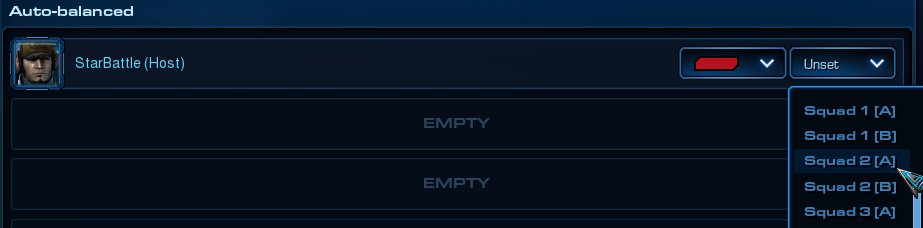

# [v4.2] - 2021-11-15

## General

- Introduced new lobby option to the Balanced game variant, that allows players to team up before the game starts, and basically play in duo. The concept is very simple - players that want to end up one the same team, must choose the same Squad number in the lobby.\
  

### Colossus

- Removed Pulse Nova ability.

### Guardian

- Corruptors:
  - Energy cost of spawning increased from 40 to 50.
  - Time life reduced from 60s to 50s.
  - Tweaked automatic target acquisition, so that Massive targets are prioritized over AI fighters.
  - Upgrade:
    - Life regeneration ratio reduced from 0.8 to 0.6 per level.

### VoidRay

- Removed Energy Reactor upgrade introduced in previous patch (extension to Purify).

### Raven

- Lock On:
  - Increased radius multiplier applied by the effect:
    - From 1.65 to 2.0 for large ships
    - From 1.8 to 2.25 for medium ships
    - From 2.35 to 2.7 for small ships

    The resulting weapon range boost is roughly ~1.5.
    > To clarify: While the ability description metions boost of the weapon range, this is actually achieved by increasing logical size of the ships, so that they can be reached from further distance by other units. However it also makes it easier to land torpedo, because of larger ship's hitbox.. and it also makes ships more "vulnerable" to rocks - ships will bounce of the rocks at the intersection of their logical radius, rather than visual - it might be a good ability to take on the rocky maps :)
  - Enhanced Systems: Reduces energy cost of activation from 50 to 25.

## Bugfixes

- Fixed an issue where players placed in `Optional Slots` (Team 2 in Balanced variant), would sometimes be matched in place of someone else from the primary team, instead of being assigned to observe the match.
