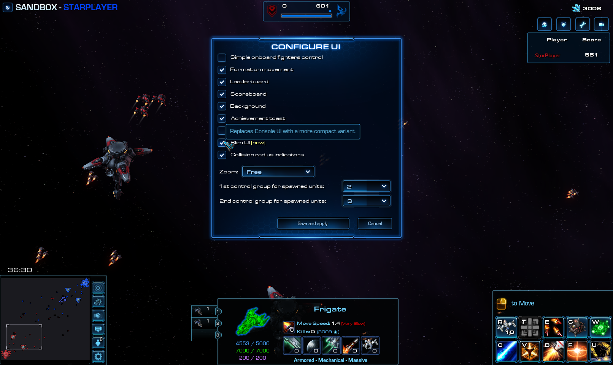
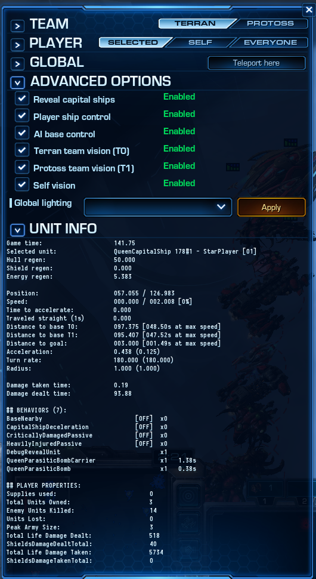

# [v4.3] - 2021-12-25

## General

This is preliminary patch that brings in a new ship - Queen (a zerg support). Yet, the ship is still a WIP. While its set of abilities is complete, merely half of the abilities is where we want them to be. Other half needs more work.\
As such the ship is locked to Sandbox mode, and shouldn't be judged until it reaches its final form.

### Dreadnought

- Cover
  - Range of the effect is now shown when the ability is active, as a visual barrier, where the size and shape of matches logical effect - correctly indicating difference of a Dreadnought with and without shields at the time.
  - Adjusted visuals to show projectiles being intercepted by Dreadnought, instead of hiding them as it was previously.

### Overlord

- Contaminate: affects allies now (friendly fire), but not the Overlord itself.

### Other

- Unified innate hull regeneration delay on all terran and protoss capital ships to match expected 5s (out of combat time), instead 20s as it was before.
  > This change doesn't impact anything alone - protoss still can't regenerate hull, and terran regenerates neligible amount (1 p/s). Doesn't affect BC's biosteel. It becomes relevant only in combination with Queen's healing symbiote.

## UI

### Slim UI

Introduced alternative compact variant of the Console UI.

\
Compare the same scene: [before](./v4.3/slim-ui-before.png) and [after](./v4.3/slim-ui-after.png)

## Sandbox

- Extended sandbox with additional options to aid with debugging and balancing. And at the same time providing some insight, and the way things work in the game - for those who seek them.\
  

## Bugfixes

- Fixed an issue where ship selection system could fallback to random ship after timeout, on ship restricted players.
- Fixed/clarified a bunch of not quite correct tooltips. From this point all tooltips are considered corrrect - stating true information. 
  > This doesn't mean that all tooltips should be trusted. It means that all tooltips known to be incorrect have been corrected.
- Fixed an issue where projectiles behind abilities were created as a player who controlled the ship, and not the casting ship. This resolves some issues related to shared control, as well as sandbox related bugs - for instance Cover of Dreadnought ignoring projectiles launched from an enemy ship, because the player launching was assigned to the Dreadnought's team.
