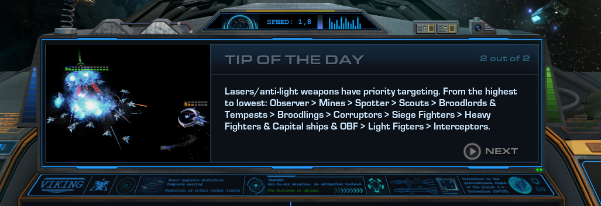
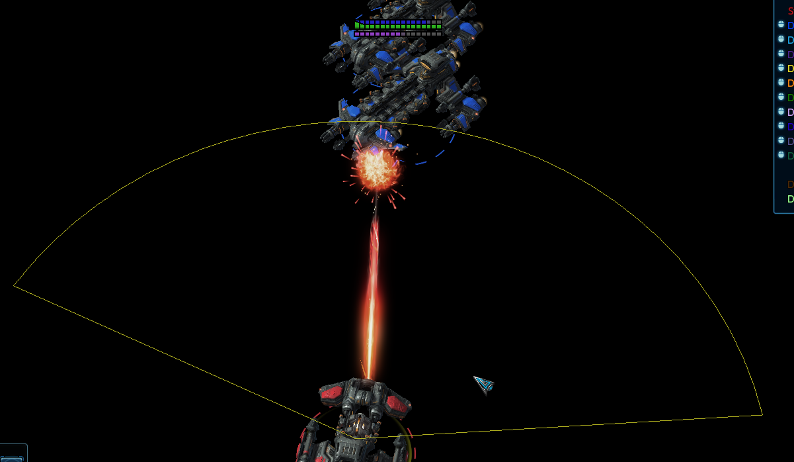
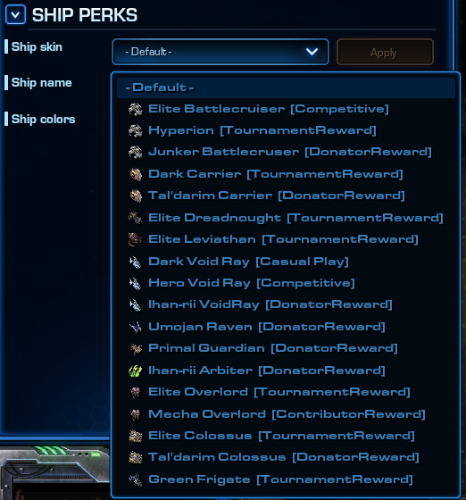

# [v4.4] - 2022-01-21

## General

- Loading screen has been tweaked:
  - Top left screen will show current version of the game, as well as the date it was relased on. Also featuring link to patch notes.
  - Introduced "Tip of the day" section. Each time it'll randomly show different tip. More tips will be introduced in future updates.
  > Thanks to AmigoDeer for art & design.

## Ships & Balance

### Terran ships

- Ship plating upgrade:
  - BC, Frigate, Raven: Hull armor increased from 3 to 4 per level.
  - Dreadnought: Hull armor increased from 4 to 5 per level.
- Shields upgrade:
  - Removed reduction of regeneration delay. It'll remain at 5s once again, regardless of the upgrade level.

> *Famous 10 shields build is no more.*\
> And even at a lower levels, shields no longer begin regenerating as quickly as before.

### Battlecruiser

- Mini Yamato Gun:
  - Weapon has now it's arc limited to 150° from the front of the ship - it can no longer shoot at targets that are behind BC.
  - Can no longer be manually targeted - will always shoot at the closest enemy target within its range.

### Dreadnought

- Explosive Charge:
  - Energy cost increased from 40 to 50.
  - Reduced cast range from 3.5 to 3.

#### Siege

- Gauss Cannon QoL improvements:
  - Retargeting is now allowed, even if weapon has already acquired the target - there's no penalty for changing target. Weapon cooldowns consistently at all times.
  - Interrupting weapon after target acqusition is now allowed - it's possible to issue any other orders between the shots. What allows relocation in any direction, while maintaining the same DPS.
  - Reduced *Damage Point* (in some circles known as Y phase) - the time before cannon acquires target and actually fires at that target. It has been reduced from 0.7s to 0.3s. (It's affected by time scale, it means it can be reduced/increased further with abilities like: Boost, Chrono Rift).
  - Mentioned Y phase no longer prevents Dreadnought from moving, but it can only fire at what's exactly in front of it while moving.
  - In case where target moves out of weapon range during Y phase, the weapon will still fire at it, so long it is within the sight of Dreadnought
  - Removed random delay between shots (could range from 0 to 0.125s). The cannon will now fire at the expected weapon period every time (3s).
  - Miss shots (weapon firing, yet ammo not landing at anything), and dealing no damage should no longer happen.
- Transformation: Combat Mode -> Siege Mode:
  - Sieging time now requires 10s - previously it was 5s. During this time Dreadnought progressively loses on speed and gains bonus to sight.
  - Energy is consumed at the end - making energy denial viable.
  - Can be manually cancelled by a player, without any cost - just like Warp can be cancelled.
  - Dreadnought has its wepoanry disabled until sieging completes like it was before, however it now retains control over launched OBF. They're recalled back to the ship once transformation is completed.
- Transformation: Siege Mode -> Combat Mode:
  - Switching back to combat mode is insant now - dreadnought becomes mobile (limited speed), regains gatlings and OBF.
  - Over the next 10s it progressively regains its speed.
  - Once completed it regains its full armor and lasers.
- Movespeed while sieged is reduced by 90% - previously it was 85%.
- Additional fixes:
  - Stasis now forces instant unsiege.
  - Transformation is now affected by Dreadnought's *time scale* during all stages (i.e. Arbiter's Boost as well as VR's Chrono Rift can influence it).

> Our goal behind behind these changes is to make Siege less all-or-nothing:
> 1. By making it smoother to use
> 1. By balancing it to be viable in more situations.
> 1. By making the use of this ability more of a strategic decision, rather than an opportunistic move.

### Raven

- Shields upgrade: Shields regeneration rate increased from 6 to 9 per level
- Reactor upgrade: Energy regeneration rate increased from 0.3 to 0.4 per level
- Enhanced Systems:
  - Mineral cost reduced from 250 to 200
  - No longer increases shield armor by 3
- Lock On:
  - Removed 0.2s cast time.
  - Target unit will have increased attack target priority.
  - For the whole duration of the effect, target unit will *threaten* nearby fighters, causing them to attack it, unless they're already acquired another target.

### VoidRay

- Chrono Rift:
  - No longer reduces acceleration as low as 0 on light units - although it still reduces it by the same %.
  - No longer affects acceleration of Capital Ships - gain of speed over time remains at the same value.

### Overlord

- Contaminate:
  - Energy cost increased from 50 to 75.
  - Added to list of friendly fire abilities (traitor system).

> Since previous patch contaminate does friendly fire, and can be used to deny the farm, and while above changes still allow it in certain scenarios, we're not looking to totally prevent it - just balance it with that fact in mind.

## Sandbox

- Extended unit info with additional data:
  - Current gain of speed, time needed to accelerate to full from current speed, and from 0.
  - Current unit order and distance to that order.
  - Time needed to replenish specific vital at a given upgrade level (such as time needed to replenish shields from 0 to max).
- Introduced an option to preview ship perks - such as skins, titles, colors (selection applies to newly spawned ships only).\
  

## Bugfixes

- Fixed an issue where Chrono Rift could reduce units acceleration to 0 (on siege fighters). Effectively stunning them, what could lead to skip of its queued order(s). Where in the end siege fighters could turn back to friendly base and despawn, or sometimes despawn in middle of the map.
- Fixed Field Disruptor to destroy Chrono Rifts as soon as Colossus gets in their range, instead of range 3 (bug since ~2015 - where Chrono Rift radius was increased by 1, but Field's Disruptor destroy effect range remained the same).
