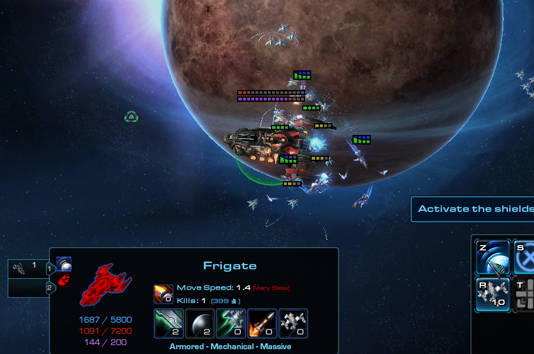
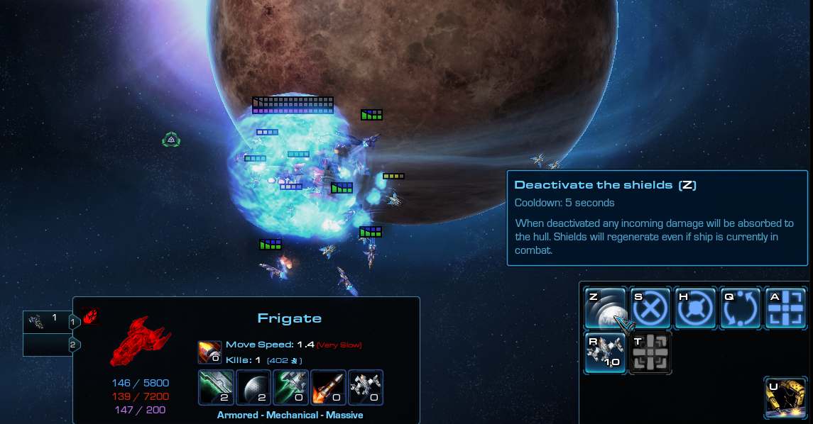

# [v4.6] - 2022-02-06

## General

- Further tweaks to autobalance & rating system.
- Ship restrictions for inexperienced players will no longer be one sided - both teams must have enough experienced players on their side in order for it to activate. (Otherwise it can negatively affect autobalance).
- UI: Life, shield and energy regen ratios shown in tooltips will now also include any modifications from buffs/debuffs. (Previously they'd only indicate innate values granted from upgrades).
- **[Experimental]** Capital ships will take twice as long to decelerate while releasing OBF.

### Battlecruiser

- Defensive Shield allows to regenerate shield and small amount of hull while in combat once again.

### Frigate

- Added new passive: Shield Boosters
  - Enhances Afterburners allowing Frigate to regenerate shields while in combat for the duration of the effect. Shield Boosters will activate only if Frigate has shields at the time.
  - Cost: 200 minerals
- Jamming Systems allow Frigate to regenerate more shields, the longer it avoided taking damage (up to 400 points per second after 1 minute out of combat).

### Raven

- Enhanced Systems:
  - No longer increases shield regen rate by 50 p/s.
  - Instead it doubles regeneration rate when Raven is out of combat for at least 10 seconds.

### Carrier

- Base energy regeneration increased from 0.8 to 1.0.
- Warp Technology: Mineral cost reduced from 250 to 150.
- Plasma Barrage:
  - Removed 3s cast time.
  - Increased intervals between each plasma missile from 0.3s to 0.4s. (Without Infite Barrage it now needs 4s to complete).

### Other

- Arbiter's Observer: will be assigned to secondary ctrl group, Phantoms to first one.
- Arbiter's Phantoms: remaining lifetime will now be shown to allies.
- Removed left-overs related to *10 shields*:
  - Guardian: Corrosive Acid no longer reduces shield regeneration of its target.
  - Dreadnought: Protective Field no longer reduces shield regeneration while active.

### Toggleable Shields

- Implemented toggleable shields for Terran ships. Available for testing via lobby option `Gameplay Data` -> `[T] Toggleable shields`.
- The idea is to provide an option for Terran ships to switch off/on the shields at any time, and take incoming damage to the hull, without having to deplete all shield points.\
  While shields are toggled off, ship can regenerate them - even in combat (however at the cost of taking hull damage).
- In its current state its merely a proof of concept - a potential idea we might expand onto, but with today's changes as well as recent changes game is not really balanced around it.
- If you like the idea, please let us know!

\

